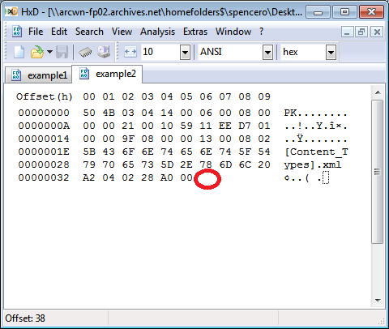

# Why Checksums? - A five minute introduction...

1.	A checksum is a mathematical rendition of a file’s content

2. It can also be called a ‘digest’ – a fixed string (set of characters), that uniquely represents a file

3. Example checksums...

* **MD5:** *D41D8CD98F00B204E9800998ECF8427E*
* **SHA1:** *DA39A3EE5E6B4B0D3255BFEF95601890AFD80709*
* **SHA256:** *E3B0C44298FC1C149AFBF4C8996FB92427AE41E4649B934CA495991B7852B855*

4. The names MD5, SHA1, and SHA256 are just names for algorithms, and some are better than others, but we use all of these in our workflows - it helps make the process robust

5. Checksums are sensitive to changes in files which is exactly what we need for our purpose

6. When we compare checksums, we compare digests - simply looking for these differences

7. They're easy to spot, take for example the file below. It represents the hexadecimal digit 0x02 (binary 0b01000000 failing to be transferred across a network with the rest of the file - for example - the connection being cut at the last minute)

8. The checksum for the original file is **77C11FD5307D21BDAE9174B3AA479E40**

9. Imagine then sending the file across the network but the power goes down, the last byte is lost.

10. The checksum for the received file is **B0225F1BD440E5A92BF1E00591A7D6C6**

11. Comparing them together we can see the two digests are very different:

<pre>
77C11FD5307D21BDAE9174B3AA479E40
B0225F1BD440E5A92BF1E00591A7D6C6
</pre>

12. The more we keep a log of digests as a file moves through our networks, the greater chance we can spot which process has caused the error because we can monitor the checksum before and after. 

13. And so, this is literally all we use them for, monitoring something hasn't happened (an error hasn't been introduced) when we transfer a file. 
